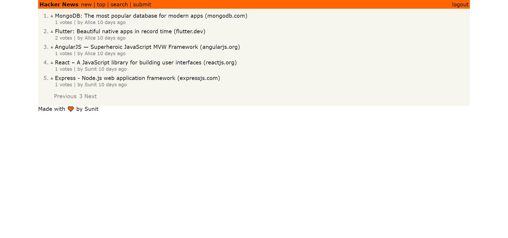

# hackernews-clone

Basic clone of [HackerNews](https://news.ycombinator.com/) for learning graphql.  
  

# Technologies
Frontend: ReactJS, Graphql, Apollo-Client  
Backend: NodeJS, Apollo-server, MySQL, Prisma-Client(ORM), graphql-subscriptions  

# Features
 - Basic Authentication and Authorization
 - Read links created by other members
 - Submit your own link
 - Upvote links with realtime UI updates
 - Pagination, Filtering and Sorting of links also available 
